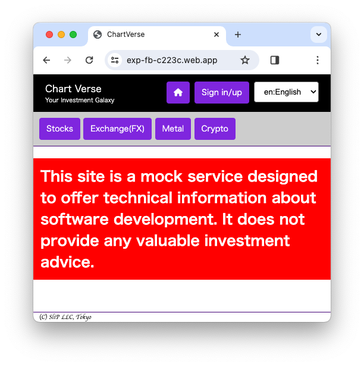

## Firebase でメンバーシップサービスを始めよう

近年、クラウドサービスの発達により、誰でも簡単に会員制のオンラインサービスを始められる環境が整ってきました。

特に、FirebaseのようなBaaS（Backend as a Service）を利用することで、開発者はバックエンド構築の複雑なプロセスを大幅に簡略化することができます。

Firebaseは、認証、データベース、ファイルストレージ、サーバーレス機能など、オンラインサービスを構築するために必要な機能の多くを提供するため、開発者はサービスのコア機能に集中することができます。

また、Firebaseはサービスの成長に合わせて自動的にスケールするため、運用コストを大幅に削減できます。

この記事では、Firebaseを使って会員制のオンラインサービスを始めるための具体的な手順を、例として架空のサービスを作りながら解説します。

### 架空サービスの仕様

#### コンセプト

- タイプ：投資情報ポータル
- 収益モデル：広告及びメルマガ購読

#### 機能要件

- ユーザー管理
- コンテンツ管理
- 入金処理
- 外部アクセス統合
  - APIs
  - Scraping

#### セキュリティ要件

- 個人情報は保存しない
- メアドとその活動を保存する

#### 技術要件

- シングルページアプリケーション(SPA)
- フロントエンド：Vanilla JS
- バックエンド：Firebase
  - データベース：Firebase Firestore
  - ユーザー認証：Firebase Authentication
- 入金方法：BitCoin
- 外部アクセス
  - 暗号資産API
  - FX API
  - 貴金属価格 Scraping

ソースコードは[https://github.com/Satachito/exp-fb](https://github.com/Satachito/exp-fb)にあります。

また実際に[ここ(https://exp-fb-c223c.web.app)](https://exp-fb-c223c.web.app)で動作させています。

