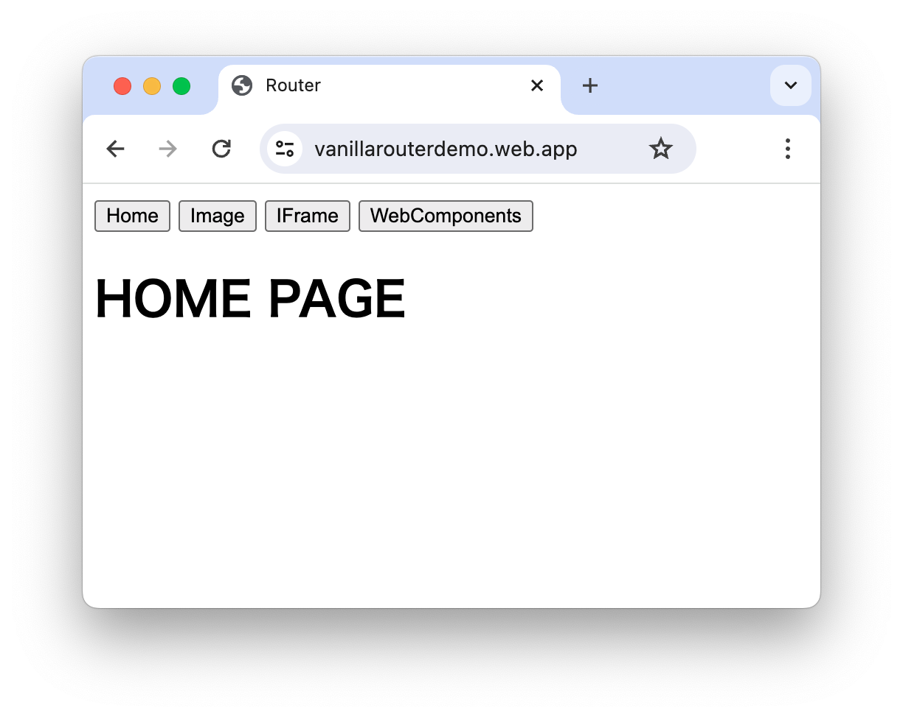
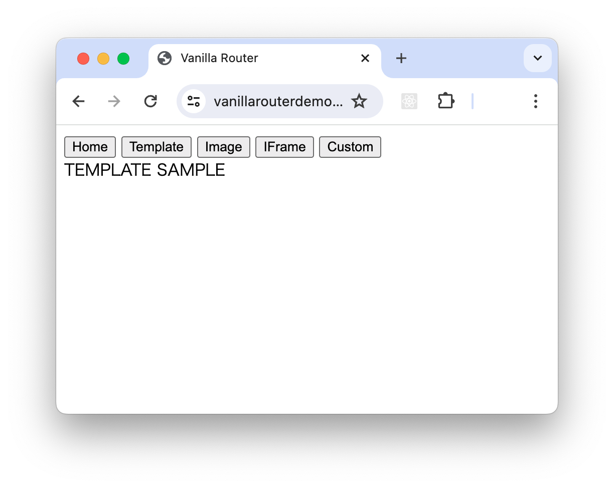
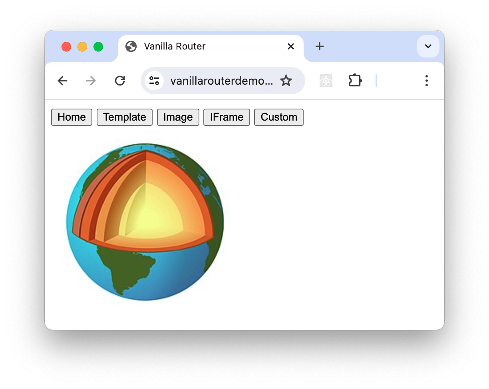
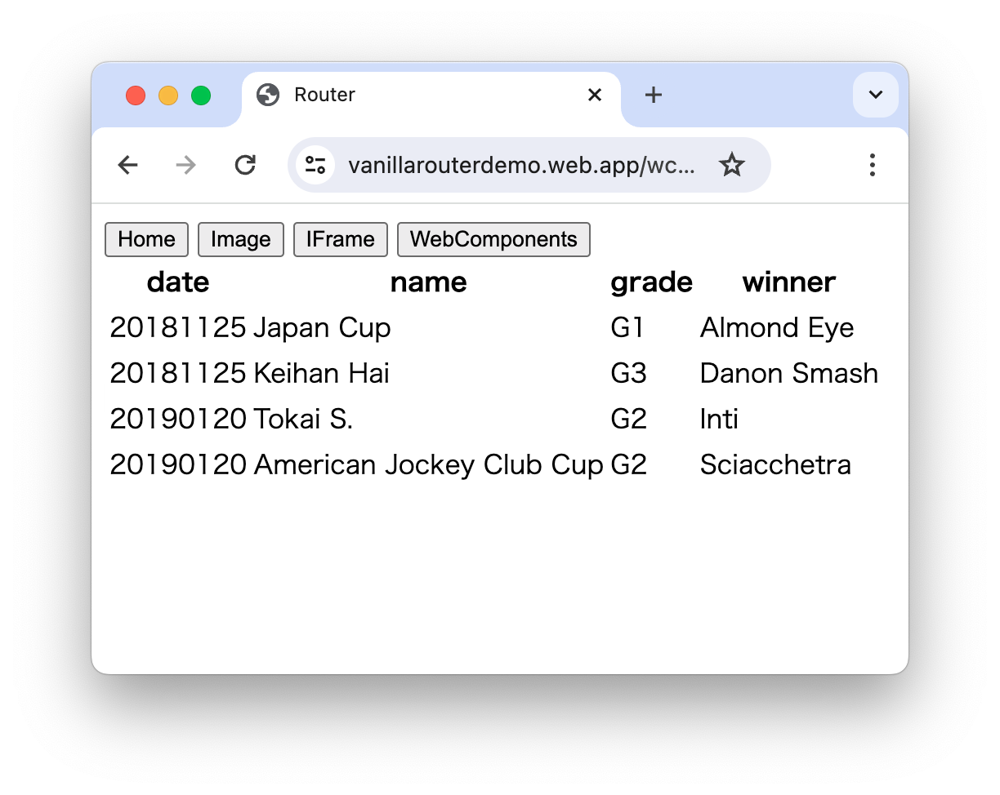

# Vanilla Router の勧め

Vanilla Router は [Vanilla JS](http://vanilla-js.com/)、すなわち JavaScript 直でルーターを書く手法を言います。フレームワークに付いているルーターを使用せずにこれを用いることの利点は文末に述べます。

まずはルーターとは何かを説明しなくてはならないのですが、その前に SPA について理解することが必要です。

## SPA とは

Web の画面遷移において、ユーザーが別のセクションに移動するときにページ全体をリロードするこれまでの手法を Multi Page Application (MPA) と呼びます。
これに対し Single Page Application (SPA)は、ユーザーがアプリケーションとやり取りをするたびにそのコンテンツを JavaScript により動的に更新するウェブ開発手法です。

## SPAのサンプル
例えば次の画面のようないくつかのページがあるサービスを考えてみます。





最初の画像はホームページで URL は https://vanillarouterdemo.web.app となっています。/index.html は存在しています。
次の画像の URL は https://vanillarouterdemo.web.app/img#https... となっていますが実際には /img/index.html は存在していません。
このサービスの例では Image ボタンを押した時 JavaScript がコンテンツ部分だけを書き換えます。そして [Histroy API](https://developer.mozilla.org/ja/docs/Web/API/History)を使って https://vanillarouterdemo.web.app/img に遷移したように履歴を登録します。このような機能をルーティングと呼びます。


## SPA の特徴

* **単一HTML**
SPA は、アプリケーション全体の基盤となる単一の HTML ページで構成されています。これにより、複数のページをリロードする必要がなくなり、ユーザーエクスペリエンスが向上し、体感遅延が減少します。
* **動的なアップデート**
SPA は、ページ全てをリロードすることなく、Web 側の JavaScript により必要な部分のみを動的にアップデートします。これによりページを遷移することのないシームレスな UX を提供できるようになります。

* **クライアント側でのルーティング**
SPAは、JavaScript を使って URL ルーティングを処理します。ユーザーのナビゲーション要求をインターセプトし、それに応じてアプリケーションの状態を更新します。これにより、サーバーとのやり取りを必要とせずに、アプリケーションの異なるセクション間をスムーズに遷移できます。

## SPA の利点

* **UX の向上**
SPAは、コンテンツの更新がページ全体の再読み込みなしで行われるため、より滑らかでレスポンシブ なユーザー体験を提供します。これにより、ユーザーのエンゲージメントと満足度が向上します。

* **パフォーマンスの向上**
SPA は、クライアントとサーバー間のデータ転送量を削減することで、パフォーマンスを向上させる可能性があります。これは、各ビューに必要なコンテンツのみが読み込まれ、ページ全体をリロードする必要がないためです。

* **保守性の向上**
SPA は、アプリケーション全体のコードが単一ページ構造に収まっているため、保守や更新が容易になります。これにより、開発やデプロイメントのプロセスが効率化されます。

## サーバーの設定

ルーティングは全ての URL を単一の HTML で処理するための SPA の中核技術です。

従来の Web アプリケーションでは全ての URL は Web サーバー上の何かしらのファイルなどのリソースに対応しています。そして実際に存在しないページをリクエストされたときに、404(Not Found)エラーを返します。

しかし SPA ではサーバーを設定してリクエストをリライトして、404 エラーの代わりに /index.html を返すようにするようにします。そして /index.html は何を表示するべきかを JavaScript を利用して呼ばれた URL を基に決定して動的に生成します。

なので、 SPA は単なるプログラムの技術ではなく、サーバーの設定も充分に考慮しなくてはなりません。

例えば firebase hosting をサーバーとして使う場合、firebase.json の hosting セクションに以下のように rewrites を記述します。

    {   ...
        "hosting": {
            ...
            "rewrites": [
                { "source": "**", "destination": "/index.html" }
            ]
        }
    }


## ルーターの実装

ルーティングを行うプログラムをルーターといいます。以下のアドレスに単純な実装をおいておきます。実際の動作はこちらで確認してみてください。

https://vanillarouterdemo.web.app/

ソースは以下のようになります。

```html
<!DOCTYPE html>
<html lang=en>
<head>

<title>Router</title>

<template id=T_HOME	><h1>HOME PAGE		</h1></template>
<template id=T_404	><h1>Page Not found	</h1></template>

</head>

<body>

<button	id=HOME_B	>Home			</button>
<button	id=IMAGE_B	>Image			</button>
<button	id=IFRAME_B	>IFrame			</button>
<button	id=WC_B		>WebComponents	</button>

<main id=MAIN></main>

<script type=module>

import	JPTable from './jp-table.js'

const
Hash		= () => decodeURIComponent( location.hash.slice( 1 ) )

const
C			= $ => document.createElement( $ )
const
E			= $ => document.getElementById( $ )
const
AC			= $ => E( 'MAIN' ).appendChild( $ )
const
Clone		= $ => AC( E( $ ).content.cloneNode( true ) )
const
HashedSrc	= $ => AC( C( $ ) ).setAttribute( 'src', Hash() )

const
Route = () => {

console.log( location.pathname, location.search, Hash() )

	E( 'MAIN' ).innerHTML = ''

	switch ( location.pathname ) {
	case '/'		: Clone		( 'T_HOME'				); break
	case '/image'	: HashedSrc	( 'img'					); break
	case '/iframe'	: HashedSrc	( 'iframe'				); break
	case '/wc'		: 
		{	const $ = new JPTable()
			$.setAttribute( 'json', Hash() )
			AC( $ )
		}
		break
	default			: Clone		( 'T_404'				); break
	}
}

window.addEventListener( 'popstate', Route )

Route()

const
Navigate = $ => (
	history.pushState( { $ }, null, $ )
,	Route()
)
E( 'HOME_B'		).onclick = () => Navigate( '/' )
E( 'IMAGE_B'	).onclick = () => Navigate( '/image#https://upload.wikimedia.org/wikipedia/commons/thumb/a/ac/Jordens_inre.jpg/230px-Jordens_inre.jpg' )
E( 'IFRAME_B'	).onclick = () => Navigate( '/iframe#/sub.html?A=B'	)
E( 'WC_B'		).onclick = () => Navigate( '/wc#{"head":["date","name","grade","winner"],"body":[[20181125,"Japan Cup","G1","Almond Eye"],[20181125,"Keihan Hai","G3","Danon Smash"],[20190120,"Tokai S.","G2","Inti"],[20190120,"American Jockey Club Cup","G2","Sciacchetra"]]}'	)

</script>
</body>
</html>
```

## Vailla Router の利点

Vue, React などのフレームワークを使っていると vue router, react router などのルーターライブラリを使うことが多いかと思います。しかしルーターをコンポーネント化せずに [Vanilla JS](http://vanilla-js.com/)で直書きすると、フレームワークベースのコンポーネントだけでなく、全てのHTML要素を自由にルーティングすることができるようになります。上のソースで示したように Vanilla Router のコード量はほんの僅かです。

* 画像、動画のようなリソース
* iframe を使って他のページリソース
* template
* WebComponents
