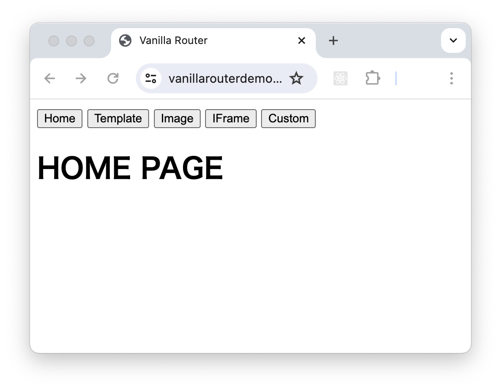
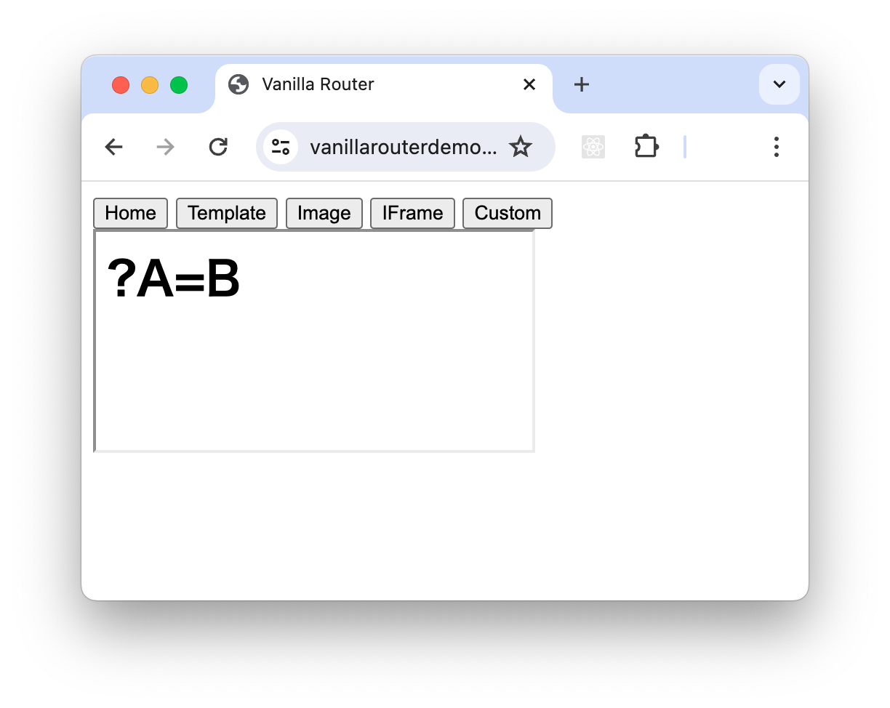

## SPAとルーター

Single Page Application (SPA)は、ユーザーがアプリケーションとやり取りをするたびにページ中の必要な部分だけを JavaScript により動的に更新するウェブ開発手法です。
これに対しユーザーがアプリケーションとやり取りをするたびにページ全体をリロードするこれまでの手法を Multi Page Application (MPA) と呼びます。
SPA のページ中の必要な部分だけを JavaScript により動的に更新する機能をルーターと呼びます。
MPA では、ページ遷移ごとにサーバー側でページを生成しそれをクライアントに送る通信が生じますが、SPA ではルーターを用いることで、サーバーとの通信を最小限に抑えつつ、シームレスな画面遷移を実現することができます。


## Vanilla Router とは

Vanilla Router は [Vanilla JS](http://vanilla-js.com/)、すなわち素の JavaScript でルーターを書く手法のことを言います。近年の Web 開発では、React や Vue などのフレームワークを用いることが多く、その場合ほぼルーターについているコンポーネント化されたルーターを使用します。コンポーネント化されたルーターは基本的にそのフレームワークで作成したコンポーネントしかルーティングすることができませんが、Vanilla Router ならあらゆる HTML 要素をルーティングできます。

## SPAのサンプル
例えば次の画面のようないくつかのページがあるサービスを考えてみます。

* ホームページ


* template ボタンが押された時のページ


* Image ボタンが押された時のページ


* IFrame ボタンが押された時のページ


* Custom ボタンが押された時のページ


最初の画像はホームページで URL は https://vanillarouterdemo.web.app となっています。/index.html は存在しています。
例えば Image ボタンを押したときの URL は https://vanillarouterdemo.web.app/img#https... となりますが実際には /img/index.html は存在していません。実際に表示されているファイルは /index.html です。
このサービスにおいてメニューに並んでいるボタンのどれかを押した時 JavaScript がメニュー以外のコンテンツ部分だけを書き換えます。そして [Histroy API](https://developer.mozilla.org/ja/docs/Web/API/History)を使って https://vanillarouterdemo.web.app/img に遷移したように履歴を登録します。これによってブラウザの履歴やバック、フォワードボタンが使えるようになります。このような機能をルーティングと呼びます。


## SPA の特徴

* **単一HTML**
SPA は、アプリケーション全体の基盤となる単一の HTML ページで構成されています。これにより、複数のページをリロードする必要がなくなり、ユーザーエクスペリエンスが向上し、体感遅延が減少します。

* **動的なアップデート**
SPA は、ページ全てをリロードすることなく、Web 側の JavaScript により必要な部分のみを動的にアップデートします。これによりページを遷移することのないシームレスな UX を提供できるようになります。

* **クライアント側でのルーティング**
SPAは、JavaScript を使って URL ルーティングを処理します。ユーザーのナビゲーション要求をインターセプトし、それに応じてアプリケーションの状態を更新します。これにより、サーバーとのやり取りを必要とせずに、アプリケーションの異なるセクション間をスムーズに遷移できます。

## SPA の利点

* **UX の向上**
SPAは、コンテンツの更新がページ全体の再読み込みなしで行われるため、より滑らかでレスポンシブ なユーザー体験を提供します。これにより、ユーザーのエンゲージメントと満足度が向上します。

* **パフォーマンスの向上**
SPA は、クライアントとサーバー間のデータ転送量を削減することで、パフォーマンスを向上させる可能性があります。これは、各ビューに必要なコンテンツのみが読み込まれ、ページ全体をリロードする必要がないためです。

* **保守性の向上**
SPA は、アプリケーション全体のコードが単一ページ構造に収まっているため、保守や更新が容易になります。これにより、開発やデプロイメントのプロセスが効率化されます。

## SPAのためのサーバーの設定

ルーティングは全ての URL を単一の HTML で処理するための SPA の中核技術です。

従来の Web アプリケーションでは全ての URL は Web サーバー上の何かしらのファイルなどのリソースに対応しています。そして実際に存在しないページをリクエストされたときに、404(Not Found)エラーを返します。

しかし SPA ではサーバーを設定してリクエストをリライトして、404 エラーの代わりに /index.html を返すようにするようにします。そして /index.html は何を表示するべきかを JavaScript を利用して呼ばれた URL を基に決定して動的に生成します。

なので、 SPA は単なるプログラムの技術ではなく、サーバーの設定も充分に考慮しなくてはなりません。

例えば firebase hosting をサーバーとして使う場合、firebase.json の hosting セクションに以下のように rewrites を記述します。

    {   ...
        "hosting": {
            ...
            "rewrites": [
                { "source": "**", "destination": "/index.html" }
            ]
        }
    }


## Vanilla Router の実装例

ルーティングを行うプログラムをルーターといいます。以下のアドレスに単純な実装をおいておきます。実際の動作はこちらで確認してみてください。

https://vanillarouterdemo.web.app/

ソースは以下のようになります。

```html
<!DOCTYPE html>
<html lang=en>
<head>

<title>Vanilla Router</title>

<template id=TEMPLATE>TEMPLATE SAMPLE</template>

</head>

<body>

<button	id=HOME_B		>Home		</button>
<button	id=TEMPLATE_B	>Template	</button>
<button	id=IMAGE_B		>Image		</button>
<button	id=IFRAME_B		>IFrame		</button>
<button	id=CUSTOM_B		>Custom		</button>

<main></main>

<script type=module>

import	JPTable from './jp-table.js'

const	Hash		= () => decodeURIComponent( location.hash.slice( 1 ) )

const	E			= $ => document.getElementById( $ )
const	C			= $ => document.createElement( $ )

const
MAIN = document.querySelector( 'main' )

const	Replace		= $ => ( MAIN.innerHTML = '', MAIN.appendChild( $ ) )
const	Clone		= $ => Replace( E( $ ).content.cloneNode( true ) )
const	HashedSrc	= $ => Replace( C( $ ) ).setAttribute( 'src', Hash() )

const	Route		= () => {
	switch ( location.pathname ) {
	case '/'			: MAIN.innerHTML = '<h1>HOME PAGE</h1>'			; break
	case '/template'	: Clone		( 'TEMPLATE'			)			; break
	case '/image'		: HashedSrc	( 'img'					)			; break
	case '/iframe'		: HashedSrc	( 'iframe'				)			; break
	case '/custom'		: Replace	( new JPTable( Hash() )	)			; break
	default				: MAIN.innerHTML = '</h1>PAGE NOT FOUND</h1>'	; break
	}
}
window.addEventListener( 'popstate', Route )
Route()

const	Navigate	= $ => (
	history.pushState( null, null, $ )
,	Route()
)
E( 'HOME_B'		).onclick = () => Navigate( '/' )
E( 'TEMPLATE_B'	).onclick = () => Navigate( '/template' )
E( 'IMAGE_B'	).onclick = () => Navigate( '/image#https://upload.wikimedia.org/wikipedia/commons/thumb/a/ac/Jordens_inre.jpg/230px-Jordens_inre.jpg' )
E( 'IFRAME_B'	).onclick = () => Navigate( '/iframe#/sub.html?A=B'	)
E( 'CUSTOM_B'	).onclick = () => Navigate( '/custom#{"head":["date","name","grade","winner"],"body":[[20181125,"Japan Cup","G1","Almond Eye"],[20181125,"Keihan Hai","G3","Danon Smash"],[20190120,"Tokai S.","G2","Inti"],[20190120,"American Jockey Club Cup","G2","Sciacchetra"]]}'	)

</script>

</body>
</html>
```

上記ソース中の`Route`という関数で`location.pathname`に基づいてコンテンツ部分-mainタグの中身-を書き換えています。

* `'/'`  の場合
`main`タグの`innerHTML`を`<h1>HOME PAGE</h1>`にしています

* `'template'`  の場合
`id=TEMPLATE`の`template`を実体化して、`main`タグの子要素にしています。

* `'image'`  の場合
`img`タグを作って`src`属性に`URL`の`hash`部分をセットして、`main`タグの子要素にしています。

* `'irame'`  の場合
`irame`タグを作って`src`属性に`URL`の`hash`部分(`/sub.html?A=B`)をセットして、`main`タグの子要素にしています。`sub.html`の中身は以下のようになっています。
```html
<h1></h1>
<script type=module>
document.querySelector( 'h1' ).textContent = location.search
</script>
```


* `'custom'`  の場合
別ファイル`(./jp-table.js)`中に記述されているカスタムエレメントを実体化して、`main`タグの子要素にしています。`jp-table.js`の中の`JPTable`は例として作った、`table`要素を引数の`json`から実体化するカスタムエレメントです。`./jp-table`の中身は以下のようになっています。
```javascript
export default class
JPTable extends HTMLElement {

	constructor( json ) {
		super()
		this.innerHTML = '<table><thead></thead><tbody></tbody></table>'

		const data = JSON.parse( json )
		const Row = ( r, t_h_d ) => '<tr>' + r.map( h_d => `<t${t_h_d}>${h_d}</t${t_h_d}>` ).join( '' ) + '</tr>'

		const table	= this.children[ 0 ]
		table.children[ 0 ].innerHTML = Row( data.head, 'h' )
		table.children[ 1 ].innerHTML = data.body.map( r => Row( r, 'd' ) ).join( '' )
	}
}

customElements.define( 'jp-table', JPTable )
```


## Vanilla Router のすゝめ

上のソースで示したように Vanilla Router のコード量はほんの僅かです。それにも関わらず以下のような全ての HTML 要素を自由にルーティングする自由度を持ちえます。

* 画像、動画のようなリソース
* iframe を使って他のページリソース
* HTMLの直書き
* template
* CustomElements/WebComponents

これが Vanilla Router をお勧めする利用です。様々な外部リソースを統合するようなSPAを作る際は、是非 Vanilla Router を検討してみてください。

最後までお読みくださいましてありがとうございました。


